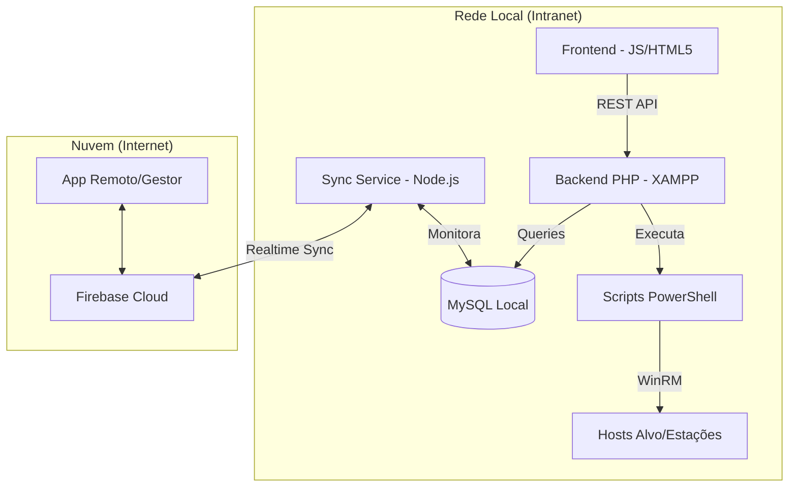

# Documentação de Arquitetura - LabControl

## 1. Objetivo
Esta documentação descreve a arquitetura técnica da plataforma LabControl, detalhando a integração entre os módulos de frontend, backend, serviços de sincronização e a camada de execução de comandos remotos. O objetivo é fornecer uma visão clara de como os dados fluem e como a redundância local/nuvem é mantida.

## 2. Visão Geral da Arquitetura

O sistema é composto por quatro camadas principais:

1.  **Frontend (Web):** Interface de usuário para monitoramento em tempo real e emissão de comandos.
2.  **Backend (Local API):** Servidor PHP responsável pela lógica de negócio, autenticação e interface com o sistema operacional (PowerShell).
3.  **Serviço de Sincronização (Worker):** Serviço Node.js que atua como ponte entre a infraestrutura local e a nuvem.
4.  **Cloud (Firebase):** Camada de persistência externa que permite o monitoramento remoto fora da rede local.

### Diagrama de Blocos (Mermaid)

## 3. Fluxo de Dados entre Módulos

### 3.1. Monitoramento de Processos (Exemplo)
1.  O **Frontend** solicita a lista de processos de um Host via `GET /api/control.php?action=processes`.
2.  O **Backend PHP** valida o token JWT e verifica se o Host está online via Ping.
3.  O PHP gera um script temporário e utiliza `exec()` para rodar o **PowerShell** (`Get-Processes.ps1`) com credenciais administrativas via WinRM.
4.  O PowerShell retorna um objeto JSON; o PHP processa e entrega ao Frontend.
5.  A ação é registrada no log do **MySQL**.

### 3.2. Sincronização Online/Offline (O fluxo Node.js)
1.  O **Sync Service (Node.js)** monitora continuamente a tabela `hosts` e `logs` no **MySQL**.
2.  Sempre que um status muda (ex: PC-01 ficou offline), o serviço detecta a mudança e faz o push para o **Firebase**.
3.  Se a internet cair, o MySQL armazena a verdade local. Assim que a conexão retorna, o Node.js identifica os registros não sincronizados (`synced = 0`) e atualiza o Firebase.

## 4. Justificativa das Escolhas Tecnológicas

| Tecnologia | Justificativa |
| :--- | :--- |
| **XAMPP (Apache/PHP)** | Facilidade de deploy em servidores Windows existentes na infraestrutura do laboratório. PHP oferece funções nativas robustas (`exec`, `shell_exec`) para interagir com o Windows. |
| **MySQL** | Banco de dados relacional padrão, confiável para auditoria e logs de longo prazo. |
| **Node.js (Sync)** | O modelo não-bloqueante (Event Loop) é ideal para serviços que precisam monitorar bancos de dados e APIs de nuvem simultaneamente sem travar a execução. |
| **Firebase** | Elimina a necessidade de configuração complexa de firewall ou port forwarding para acesso externo, fornecendo sincronização em tempo real e autenticação escalável. |
| **Tailwind CSS** | Utilizado no frontend para garantir uma interface moderna, responsiva e de rápido desenvolvimento através de classes utilitárias. |
| **PowerShell** | Linguagem nativa do Windows para administração. Permite controle granular sobre processos, serviços e estado do sistema que APIs web comuns não alcançam. |

## 5. Estratégia de Sincronização Online/Offline

A arquitetura adota o modelo **Local-First with Cloud Reflection**:

*   **Persistência Local (MySQL):** É a "Fonte da Verdade" primária. Todos os comandos e mudanças de status são gravados primeiro localmente. Isso garante que, mesmo sem internet, o painel de controle dentro do laboratório funcione perfeitamente.
*   **Bridge de Sincronização:** O serviço Node.js utiliza uma flag `synced` (0 ou 1) nas tabelas. 
    *   **Upstream:** MySQL -> Firebase (Status dos hosts, novos logs).
    *   **Downstream:** Firebase -> MySQL (Comandos enviados remotamente via App Cloud).
*   **Resiliência:** Em caso de falha na rede externa, o serviço de sincronização entra em modo de retentativa exponencial, garantindo que nenhum log de auditoria seja perdido quando a conexão for reestabelecida.

---
*Atualizado em: 06/03/2026*
