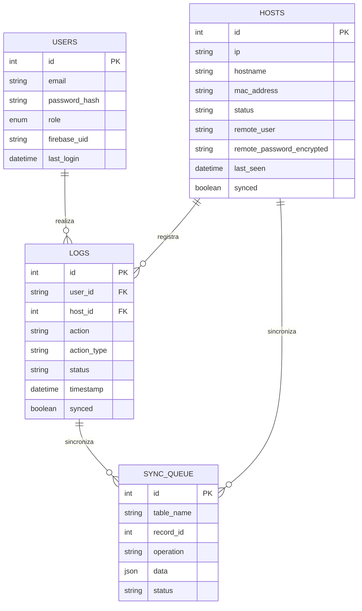

# Documentação de Banco de Dados - LabControl

## 1. Objetivo
Esta documentação descreve a estrutura de dados do LabControl, incluindo tabelas, campos, relacionamentos e exemplos de uso. O banco de dados utiliza o motor **InnoDB** (MySQL/MariaDB) para garantir integridade referencial e suporte a transações.

## 2. Modelo Entidade-Relacionamento (ER)

O banco de dados é centrado na entidade `hosts`, com logs de auditoria vinculados a usuários e máquinas.



## 3. Descrição das Tabelas

### 3.1. Tabela `users`
Armazena os usuários autorizados a acessar o painel de controle local.
*   `password_hash`: Armazena a senha utilizando o algoritmo BCRYPT.
*   `role`: Define permissões (`admin` ou `operator`).
*   `firebase_uid`: ID correspondente no Firebase Auth para login unificado.

### 3.2. Tabela `hosts`
Entidade principal que representa as estações de trabalho monitoradas.
*   `status`: Atualizado dinamicamente (`online`, `offline`, `unknown`).
*   `remote_password_encrypted`: Senha de administrador da máquina local, criptografada com AES-256 no backend.
*   `synced`: Flag (0/1) que indica se a mudança de status já foi replicada para a nuvem.

### 3.3. Tabela `logs`
Histórico completo de auditoria para conformidade e segurança.
*   `action_type`: Categoriza a ação (`system`, `host`, `query`, `control`).
*   `details`: Campo de texto ou JSON com dados extras sobre a execução do comando.

### 3.4. Tabela `sync_queue`
Fila técnica para gerenciar a consistência entre o banco local e o Firebase em cenários de instabilidade de rede.

## 4. Relações e Integridade
*   **Chave Estrangeira:** `logs.host_id` referencia `hosts.id`. Configurado com `ON DELETE SET NULL` para preservar o histórico de logs mesmo se um host for removido do inventário.
*   **Unicidade:** `hosts.ip` e `users.email` são campos únicos (UNIQUE) para evitar duplicidade de registros.

## 5. Exemplos de Queries Comuns

### Inserir um Novo Host
```sql
INSERT INTO hosts (ip, hostname, mac_address, location, os_type) 
VALUES ('192.168.1.50', 'LAB01-PC20', 'AA:BB:CC:DD:EE:FF', 'Sala 2', 'Windows 11');
```

### Consultar Estatísticas em Tempo Real
```sql
SELECT 
    COUNT(*) as total,
    SUM(status = 'online') as online,
    SUM(status = 'offline') as offline
FROM hosts WHERE is_active = 1;
```

### Obter Últimas Ações de um Usuário
```sql
SELECT action, host_ip, timestamp, status 
FROM logs 
WHERE user_email = 'admin@labcontrol.local' 
ORDER BY timestamp DESC 
LIMIT 10;
```

### Marcar Registros como Sincronizados
```sql
UPDATE hosts SET synced = 1 WHERE id IN (1, 2, 3);
```

## 6. Views Disponíveis
O sistema conta com views pré-definidas para facilitar relatórios:
*   `v_hosts_online`: Lista apenas máquinas com status ativo.
*   `v_host_stats`: Sumário rápido de saúde do laboratório.
*   `v_logs_pending_sync`: Fila de auditoria aguardando envio para a nuvem.

---
*Documentação Gerada em: 06/03/2026*
